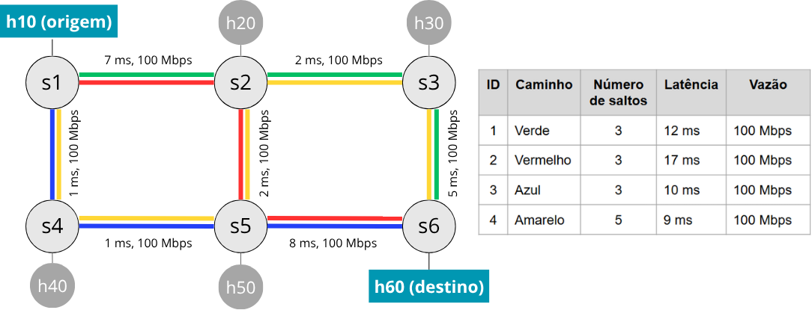
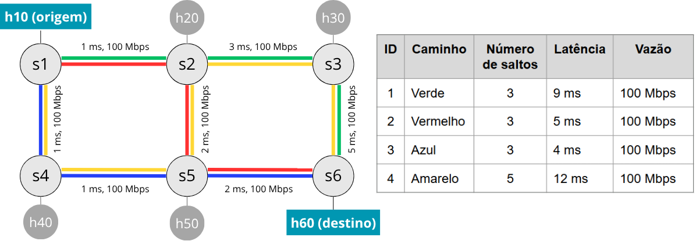

# Avaliação do uso de Aprendizado de Máquina para Engenharia de Tráfego em Redes Cientes de Caminho

Este repositório contém o código-fonte e os datasets utilizados no artigo *Avaliação do uso de Aprendizado de Máquina para Engenharia de Tráfego em Redes Cientes de Caminho*, submetido para avaliação no [44º Simpósio Brasileiro de Redes de Computadores e Sistemas Distribuídos (SBRC)](https://sbrc.sbc.org.br/2026/).

Este projeto investiga a aplicação de modelos de aprendizado de máquina para previsão de caminhos em redes conscientes de caminho, com o objetivo de otimizar a engenharia de tráfego. Inclui um protótipo de simulação de rede, datasets coletados e análises de modelos de AM.

## Autores
Beatriz Mariano<sup>1</sup>, 
Cristina Dominicini<sup>1</sup>,
Domingos Paraíso<sup>1</sup>,
Eduarda Coelho<sup>1</sup>,
Daniel Ventorim<sup>2</sup>, 
Giovanni Ventorim Comarela<sup>2</sup>,
Magnos Martinello<sup>2</sup>

<sup>1</sup> Instituto Federal do Espírito Santo (IFES),
<sup>2</sup> Universidade Federal do Espírito Santo (UFES)

## Pré-requisitos

- Python 3.8 ou superior
- Mininet e Ryu (para o protótipo de simulação de rede)
- Bibliotecas Python: ver `requirements.txt`

## Instalação

1. Clone o repositório:
   ```
   git clone <url-do-repositorio>
   cd path-aware-datasets
   ```

2. Para o protótipo, instale o Mininet conforme a documentação oficial: [Mininet Installation](http://mininet.org/download/)
3. Crie um ambiente virtual python:
    ```
    python3 -m venv venv

    ou

    python3 -m venv --system-site-packages venv (mantêm visão global dos pacotes instalados globalmente)
    source venv/bin/activate
    ```

4. Instale as dependências Python:
    ```
    pip install -r requirements.txt
    ```

5. Atualize o arquivo `prototipo/run.sh` para adequar-se ao seu ambiente de trabalho (linhas 4 e 11) 

6. Atualize os cenários de teste em `prototipo/config.json`

7. Execute o protótipo:
    ```
    cd prototipo
    ./run.sh
    ```

## Protótipo

O protótipo simula uma rede SDN usando Mininet e coleta dados de telemetria para análise.

### Como executar

Para executar o protótipo, é necessário ter todos os requisitos instalados. Recomenda-se rodar o projeto na máquina real, embora também seja possível utilizar a máquina virtual pré-configurada do Mininet.

1. Navegue para a pasta `prototipo`:
   ```
   cd prototipo
   ```

2. Execute o script principal (linux):
   ```
   ./run.sh
   ```

### Arquivo config.json

O arquivo `config.json` contém configurações para a simulação:
- `topologia`: Define a estrutura da rede (switches, hosts, links).
- `controlador`: Configurações do controlador SDN (e.g., Ryu).
- `teste`: Parâmetros para os testes de tráfego.
- `plotagem`: Opções para geração de gráficos.

Exemplo de configuração básica pode ser encontrado em `config.example.json`.

Cada teste coleta latências, largura de banda e rotas utilizadas.

## Datasets

Os datasets foram coletados utilizando o protótipo deste repositório, na seguinte topologia:

<div style="display: flex; gap: 10px;">
    <figure>
        <figcaption style="text-align: center;">Topologia - Latências originais</figcaption>
        
    </figure>
    <figure>
    <figcaption style="text-align: center;">Topologia - Latências modificadas</figcaption>
        
    </figure>
</div>

Todos os datasets coletados no protótipo estão disponibilizados dentro da pasta `datasets`. A estrutura de pastas segue o mesmo padrão de nomenclatura definidas no artigo.

Os datasets incluem:
- Arquivos de latência por rota (e.g., `latencia_rota_h11_h61.txt`)
- Arquivo de configuração utilizado para a coleta (`config.json`)
- Eventos e resumos (`eventos.txt`, `rotas.txt`, `iperf_procN.txt`)
- Dados consolidados de latência e rótulos de classificação (`latencia_rotas_h1_h6.csv` e `rotulos_h1_h6.txt`)
- Banda consolidada de todas as interfaces no momento da coleta (`banda.bwm`), a partir da qual são extraídos os relatórios de banda por caminho (ver `gerar_relatorio_banda_rotas.py`)

### Relatórios de banda por caminho

O arquivo `banda.bwm` de cada cenário contém a saída do `bwm-ng` para todas as interfaces monitoradas durante a coleta, sem distinção de rota. O script `gerar_relatorio_banda_rotas.py`, na raiz do repositório, extrai desse arquivo a banda disponível de cada rota listada em `rotas.txt`, usando as interfaces e capacidades definidas em `config.json`.

Para gerar (ou regenerar) os relatórios de todos os cenários em `datasets/`:
```
python3 gerar_relatorio_banda_rotas.py
```

Para cada rota, são gerados dentro da própria pasta do cenário:
- `banda_tratada_<rota>.csv`: taxa e banda disponível de cada interface do caminho, amostra a amostra.
- `banda_<rota>.txt`: gargalo (menor banda disponível entre as interfaces do caminho) por segundo, no mesmo formato tabulado dos arquivos `latencia_rota_*.txt`.

Cenários sem `banda.bwm`, `config.json` ou `rotas.txt` (e.g. `D3a`, `D4a`) são ignorados pelo script.

## Resultados da aplicação de Aprendizado de Máquina

Para analisar os modelos de ML:

1. Abra o notebook `Análise_de_modelos_de_ML_para_previsão_de_caminhos.ipynb` no Jupyter (ou em qualquer IDE de sua preferência que suporte arquivos .ipynb).

2. Execute as células para pré-processamento dos dados, treinamento dos modelos e plotagem de gráficos.

Scripts auxiliares:
- `main.py`: Consolida dados de latência.
- `plot_latencias.py`: Plota latências nos caminhos.
- `plot_matriz_confusao.py`: Gera matriz de confusão para modelos de classificação.
- `gerar_relatorio_banda_rotas.py`: Extrai, a partir de `banda.bwm`, os relatórios de banda disponível por caminho de cada cenário em `datasets/` (ver seção [Relatórios de banda por caminho](#relatórios-de-banda-por-caminho)).

Resultados salvos em `resultados_am/`.

## Contato

Para dúvidas, entre em contato com os autores.

- biaauer03@gmail.com
- cristina.dominicini@ifes.edu.br 
- danielventorim@gmail.com
- domingos.paraiso@gmail.com 
- dudancoelho13@gmail.com
- gc@inf.ufes.br
- magnos@inf.ufes.br
