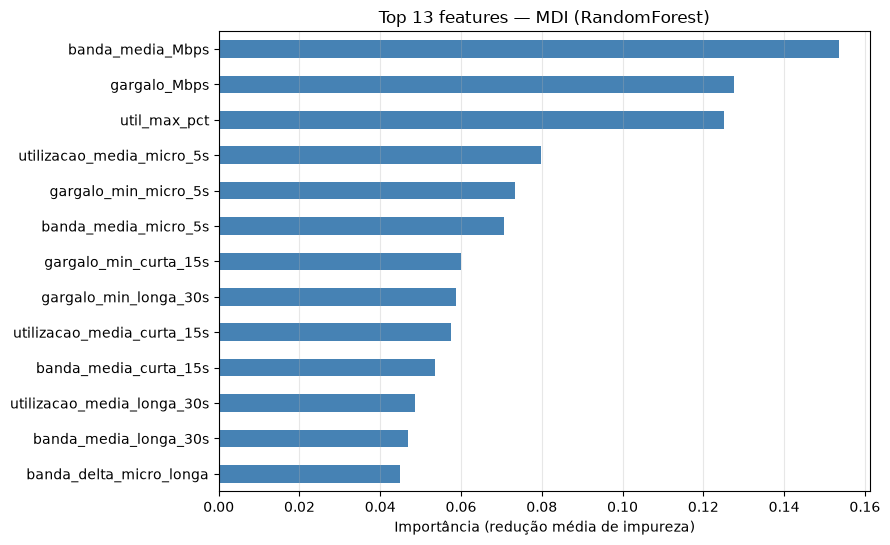
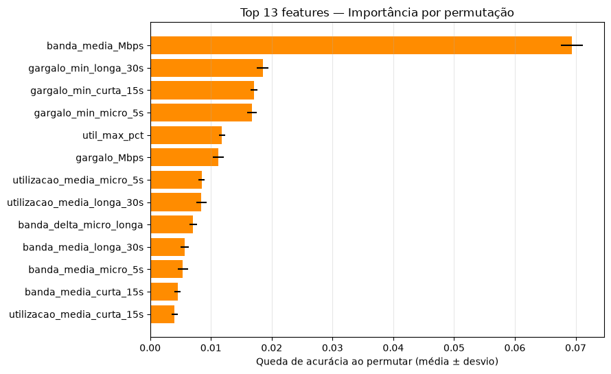
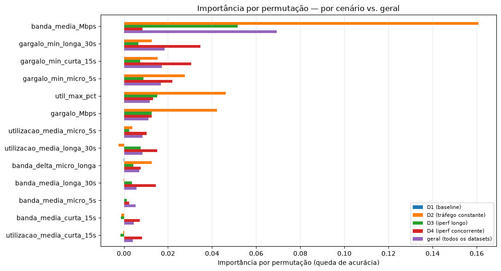
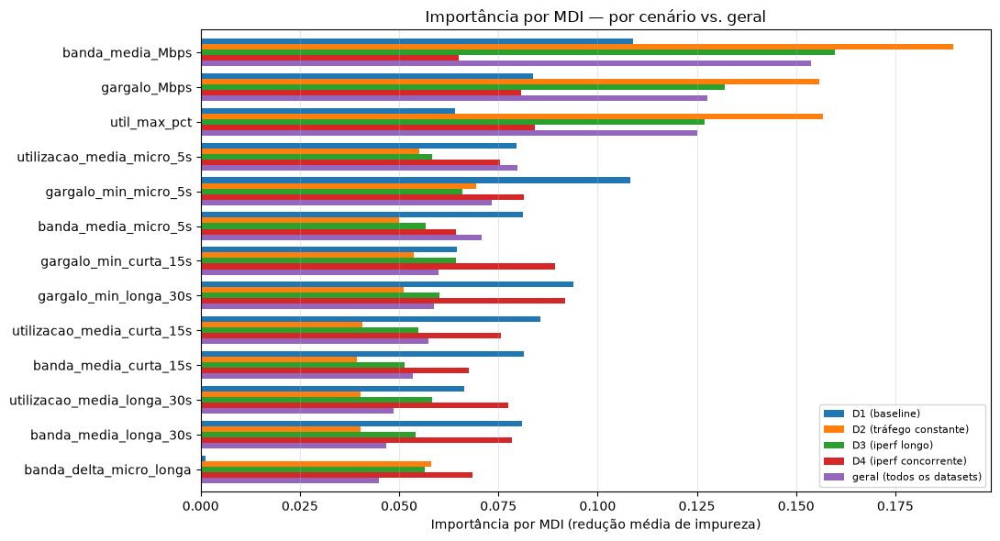
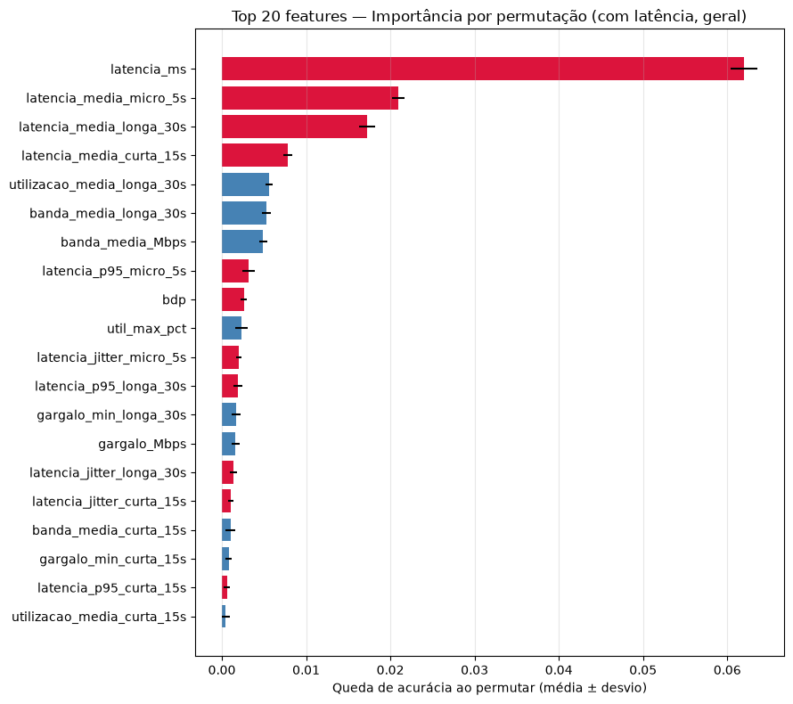
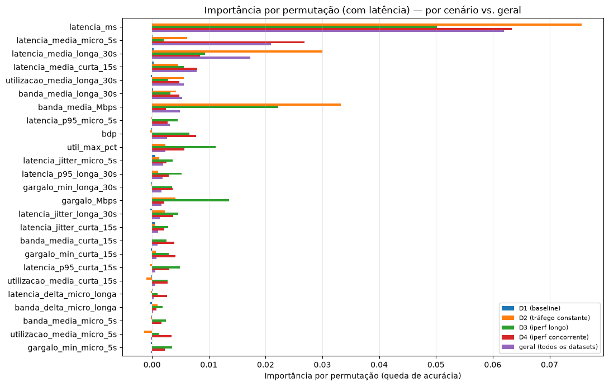
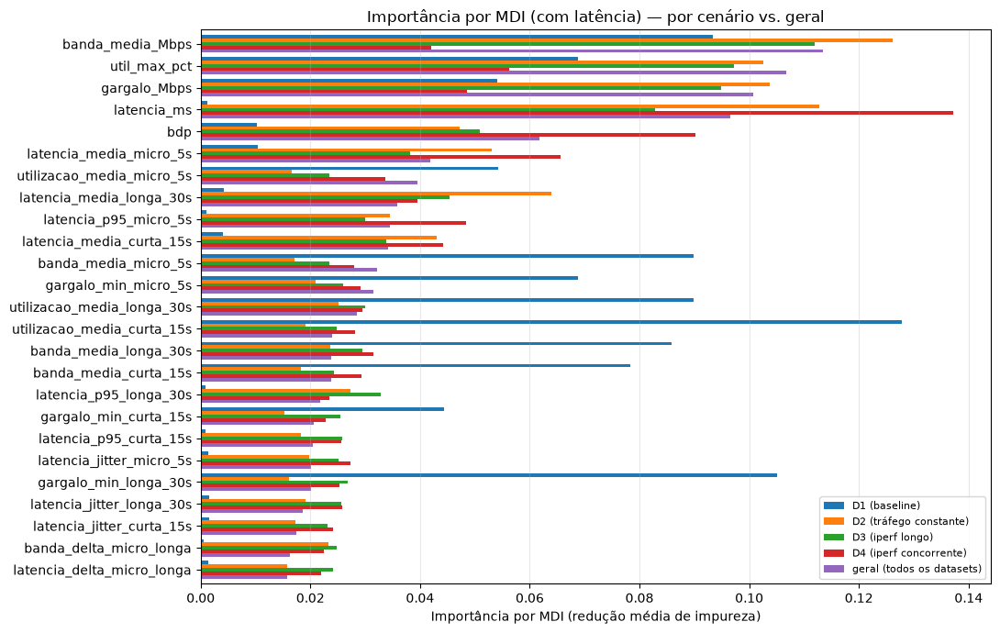

# Resumo — Feature Store e Análise de Feature Importance

Este documento resume a *feature store* construída a partir dos conjuntos de
dados `datasets/D1` a `D4` (e suas variantes `b`) e os resultados da análise
de importância de features para a previsão da rota de menor latência
(`melhor_rota`), realizada em `Feature_Store_Datasets.ipynb`.

## 1. Cenários de coleta

A *feature store* é construída separadamente para cada dataset, que
representa um regime distinto de tráfego de fundo na rede:

| cenário | datasets | descrição |
|---|---|---|
| **D1** | `D1`, `D1b` | linha de base, sem tráfego de fundo |
| **D2** | `D2`, `D2b` | tráfego de fundo constante |
| **D3** | `D3`, `D3b` | tráfego de fundo com um fluxo iperf longo |
| **D4** | `D4`, `D4b` | tráfego de fundo com múltiplos fluxos iperf concorrentes |

`D3a` e `D4a` foram excluídos por conterem apenas uma coleta secundária
parcial (sem `eventos.txt`, `banda.bwm`, `rotas.txt` ou `config.json`),
insuficiente para reconstruir a store.

Cada cenário cobre aproximadamente uma hora de coleta contínua (3600–3850 s
úteis por rota), com 4 rotas candidatas (`h11_h61`, `h12_h62`, `h13_h63`,
`h14_h64`) monitoradas simultaneamente.

## 2. Features da feature store

A tabela `consolidado` (grão: run × rota × timestamp) reúne as seguintes
famílias de features, todas derivadas de duas fontes brutas: latência
(RTT medido por `ping`) e banda (utilização de interface capturada pelo
`bwm-ng`).

### 2.1 Métricas instantâneas

| feature | método de construção | potencial preditivo |
|---|---|---|
| `latencia_ms` | RTT medido pelo `ping`, amostrado por segundo | sinal direto de congestionamento fim a fim da rota; define o alvo (`melhor_rota = argmin(latencia_ms)`), portanto vazamento de rótulo — ver Seção 4 |
| `gargalo_Mbps` | menor banda disponível entre as interfaces do caminho (mín. das interfaces do trajeto) | representa o "elo mais fraco" da rota — a banda de um caminho é limitada por seu gargalo, não pela média |
| `banda_media_Mbps` | média da banda disponível entre todas as interfaces do caminho | contexto geral de disponibilidade de banda no trajeto, menos sensível a ruído pontual de uma única interface |
| `util_max_pct` | maior utilização (%) observada entre as interfaces do caminho | sinaliza saturação — interfaces com uso próximo de 100% tendem a introduzir fila e, consequentemente, latência |

### 2.2 Features de janela deslizante (`micro`=5s, `curta`=15s, `longa`=30s)

Cada métrica de latência e banda é também agregada em três janelas
temporais, para capturar tendência recente vs. contexto mais amplo:

| padrão de coluna | método | motivo/potencial |
|---|---|---|
| `latencia_p95_{janela}` | percentil 95 da latência na janela | captura a "pior latência típica", mais robusta a outliers que o máximo |
| `latencia_jitter_{janela}` | desvio padrão da latência na janela | mede instabilidade/variabilidade da rota — rotas com alto jitter podem ser piores mesmo com latência média baixa |
| `latencia_media_{janela}` | média da latência na janela | suaviza ruído de amostra a amostra do RTT |
| `gargalo_min_{janela}` | pior gargalo observado na janela | detecta degradação recente de banda antes que se reflita na média |
| `banda_media_{janela}` | média da banda disponível na janela | tendência de disponibilidade de banda no curto/médio prazo |
| `utilizacao_media_{janela}` | utilização média (0–1) na janela | tendência de saturação — complementa `util_max_pct` (instantâneo) com visão temporal |

A motivação de usar três janelas (5s/15s/30s) é permitir que o modelo escolha
entre reagir rapidamente a mudanças (janela curta) ou usar um sinal mais
estável e menos ruidoso (janela longa), sem impor essa escolha a priori.

### 2.3 Deltas e features cruzadas

| feature | método | potencial |
|---|---|---|
| `latencia_delta_micro_longa` | latência média recente (5s) menos latência média de contexto (30s) | captura *tendência*: uma rota piorando recentemente é diferente de uma rota estável, mesmo com a mesma latência instantânea |
| `banda_delta_micro_longa` | pior gargalo recente (5s) sobre banda média de contexto (30s) | mede a severidade da degradação atual relativa ao "normal" da rota |
| `bdp` (*Bandwidth-Delay Product*) | `gargalo_Mbps × latencia_ms` | estima o volume de dados em trânsito no caminho; combina os dois sinais principais em uma única feature, mas herda o vazamento de `latencia_ms` |

### 2.4 Identificadores e dimensão de rota

Colunas como `run_id`, `rota_id`, `ts_epoch`, `datetime_utc`,
`tempo_relativo_s` e `dataset_id` (chaves/timestamps) e `dim_rota`
(`caminho`, `n_links_sw`, `atraso_cfg_ms` — atributos fixos do caminho) são
mantidas na store para rastreabilidade e análises auxiliares, mas são
excluídas da modelagem de importância por não representarem sinais de rede
em tempo real (ver Seção 4).

## 3. Análise de feature importance

### 3.1 Metodologia

A análise treina um `RandomForestClassifier` para prever `melhor_rota` e
mede a importância de cada feature por **dois métodos complementares**:

- **MDI (Mean Decrease in Impurity / importância por impureza)**: calculada
  diretamente do `feature_importances_` do RandomForest durante o treino, a
  partir da redução média de impureza (Gini) em cada split. É rápida (não
  exige computação adicional), mas **enviesada a favor de features de alta
  cardinalidade/variância** — métricas instantâneas tendem a ter mais valores
  distintos que agregados de janela, inflando artificialmente sua importância
  aparente.
- **Importância por permutação**: embaralha cada coluna, uma de cada vez, no
  conjunto de teste e mede a queda de acurácia resultante. É mais custosa
  computacionalmente (requer múltiplas reavaliações do modelo), mas **reflete
  diretamente o impacto real na métrica de interesse**, sendo a referência
  mais confiável quando os dois métodos divergem.

Ambos os métodos foram aplicados tanto ao conjunto **geral** (todos os 8
datasets combinados) quanto **separadamente por cenário** (`D1`/`D1b` a
`D4`/`D4b`), permitindo verificar se a importância relativa das features é
estável ou muda conforme o regime de tráfego de fundo.

A análise foi feita em duas variantes:
1. **Sem latência** — exclui `latencia_*` e `bdp`, para revelar a importância
   relativa **dentro** do grupo de features de banda/gargalo (13 features).
2. **Com latência** — inclui todas as 25 features, para quantificar o quanto
   a latência domina quando presente e onde as features de banda se
   posicionam mesmo competindo diretamente com ela.

### 3.2 Gráficos — sem latência

**MDI (geral)**

**Importância por permutação (geral)**

**Importância por permutação — por cenário vs. geral**

**Importância por MDI — por cenário vs. geral**

### 3.3 Gráficos — com latência

**Importância por permutação (com latência, geral)** — vermelho = feature de
latência/bdp, azul = feature de banda/gargalo

**Importância por permutação (com latência) — por cenário vs. geral**

**Importância por MDI (com latência) — por cenário vs. geral**

### 3.4 Comparação: latência vs. banda

| | sem latência (13 features) | com latência (25 features) |
|---|---|---|
| Acurácia geral | **84,6%** | **89,0%** |
| Ganho de acurácia | — | **+4,5 p.p.** |
| Feature dominante (permutação) | `banda_media_Mbps` (0,069) | `latencia_ms` (0,062, ~3× a 2ª posição) |
| Feature dominante (MDI) | `banda_media_Mbps` (0,154) | `banda_media_Mbps` continua entre as 3 primeiras, mesmo com todas as features de latência presentes |

O ganho de acurácia relativamente modesto (+4,5 p.p., não os ~100% que uma
dependência determinística perfeita sugeriria) indica que **a banda por si
só já carrega grande parte da informação necessária** para prever a rota de
menor latência — o gargalo de um caminho está correlacionado com sua
latência, mas não é equivalente a ela.

Por cenário, o padrão de acurácia com/sem latência é consistente:

| cenário | sem latência | com latência | ganho |
|---|---|---|---|
| D1 (baseline) | 0,9937 | 0,9937 | 0,000 |
| D2 (tráfego constante) | 0,8365 | 0,8812 | +0,045 |
| D3 (iperf longo) | 0,8059 | 0,8404 | +0,035 |
| D4 (iperf concorrente) | 0,8153 | 0,8639 | +0,049 |
| **Geral** | **0,8455** | **0,8903** | **+0,045** |

Em D1 não há ganho, pois a rede está ociosa e ambos os modelos já
atingem ~99% de acurácia. Nos cenários com tráfego de fundo, incluir a
latência agrega de 3,5 a 4,9 pontos percentuais.

Mesmo com a latência dominando a importância por permutação no conjunto
combinado, as features de banda mantêm posições relevantes no ranking de 25
features: `banda_media_Mbps` na 7ª posição, `util_max_pct` na 10ª,
`gargalo_Mbps` na 14ª — todas dentro do top-15, evidência de que carregam
sinal complementar, não apenas redundante em relação à latência.

### 3.5 Resultados gerais e features mais importantes

**Sem latência**, os dois métodos concordam que `banda_media_Mbps` é a
feature mais importante, com folga, tanto por MDI (0,154) quanto por
permutação (0,069). Na posição intermediária os métodos divergem: MDI
privilegia `gargalo_Mbps` e `util_max_pct` (2º-3º lugar), enquanto a
permutação privilegia as versões em janela do gargalo
(`gargalo_min_longa/curta/micro_*`, 2º-4º lugar) — consistente com o viés
conhecido do MDI a favor de features de alta cardinalidade. As três variantes
de `gargalo_min_{janela}` aparecem entre as 4 mais importantes por
permutação, sugerindo que a *tendência recente* do gargalo (não apenas seu
valor pontual) ajuda o modelo a diferenciar rotas.

**Por cenário**, o padrão de importância muda substancialmente:

- **D1 (baseline)**: apesar de a rede estar praticamente ociosa (~100 Mbps
  constantes), diversas features ainda mantêm importância por permutação
  comparável ou superior à dos demais cenários (ex.: `gargalo_min_micro_5s`
  em 0,108, `banda_media_Mbps` em 0,109) — indício de diferenças residuais
  sistemáticas entre rotas que o RandomForest consegue explorar mesmo sem
  variação real de congestionamento.
- **D2 (tráfego constante)**: `banda_media_Mbps` concentra a maior parte da
  importância (0,190, acima da média geral de 0,154).
- **D3/D4 (fluxos iperf)**: a importância se distribui mais entre
  `gargalo_min_{janela}` e `util_max_pct`, coerente com a natureza
  intermitente desses cenários; em D4, por exemplo, `gargalo_min_longa_30s`
  (0,092) e `gargalo_min_curta_15s` (0,089) superam `banda_media_Mbps`
  (0,065).

Isso confirma que a importância "geral" (todos os datasets combinados) é uma
média que mistura regimes de tráfego com padrões de importância distintos
entre si — analisar por cenário revela nuances que a visão agregada esconde.

**Com latência**, `latencia_ms` domina isoladamente a importância por
permutação no cenário combinado, mas as features de banda (`banda_media_Mbps`,
`gargalo_Mbps`, `util_max_pct`) permanecem entre as mais importantes por MDI
mesmo competindo com toda a família de features de latência — reforçando que
carregam sinal útil e não apenas informação redundante com a latência.

## 4. Limitações e ressalvas

- **Vazamento no alvo**: `melhor_rota` é função determinística de
  `latencia_ms` por construção, o que motivou a análise em duas variantes
  (com/sem latência) para isolar o sinal de banda.
- **Vazamento parcial mesmo sem latência**: features de banda no mesmo
  instante (`gargalo_Mbps`, `banda_media_Mbps`) podem carregar parte da mesma
  causalidade que gera a latência mais baixa (ex.: link congestionado eleva
  latência e reduz banda simultaneamente) — a importância observada reflete
  correlação contemporânea, não necessariamente uma relação preditiva
  "antecedente" (isto é, banda medida *antes* de a latência mudar).
- **Volume por cenário**: cada cenário corresponde a uma única execução de
  ~1 hora, sem repetições que permitam estimar variância entre execuções do
  mesmo regime de tráfego.
- **MDI vs. permutação**: quando os dois métodos divergem, a permutação é a
  referência mais confiável, por medir diretamente o impacto na acurácia.
